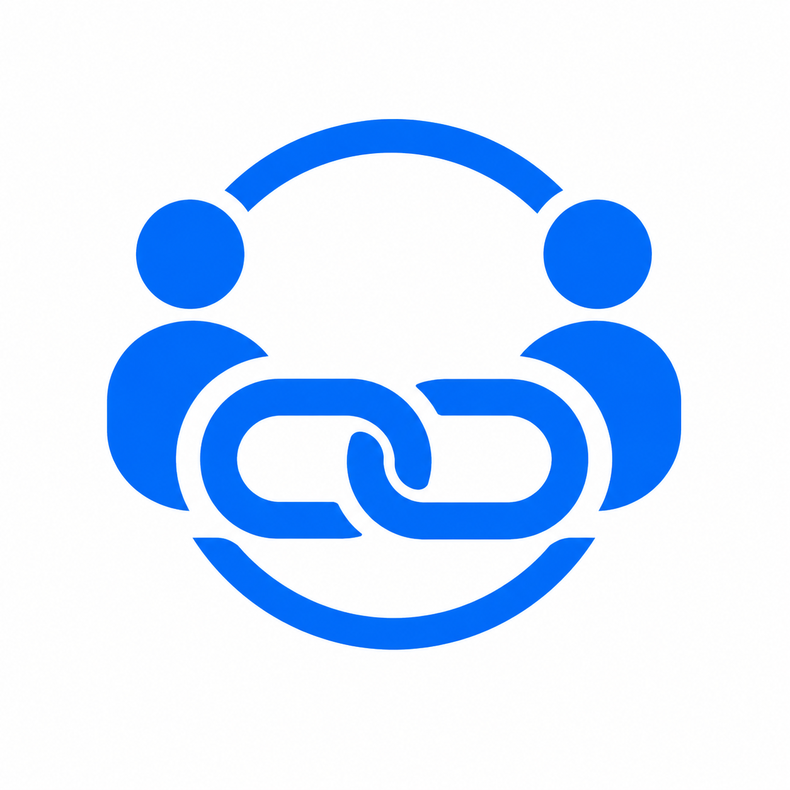
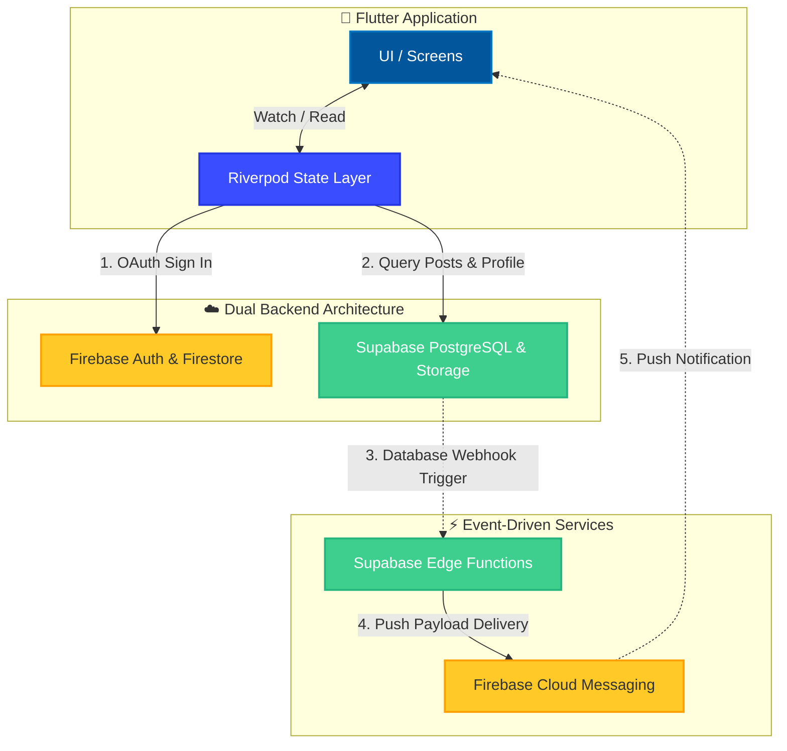
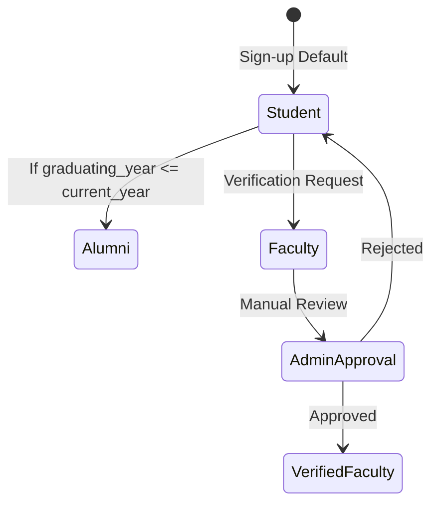

<div align="center">



# LinkPeer
<a href="https://play.google.com/store/apps/details?id=com.swynx.linkpeer">
  
</a>

**The official campus social platform for Indira Gandhi Institute of Technology, Sarang, Odisha.**  
A full-stack Flutter mobile application connecting students, alumni, and faculty through a shared community feed, career opportunities, and campus announcements.

<br/>

[](https://flutter.dev)
[](https://dart.dev)
[](https://firebase.google.com)
[](https://supabase.com)
[](https://riverpod.dev)
[](https://m3.material.io)
[](LICENSE)

</div>

---

## Overview

LinkPeer is a production-ready mobile application built with Flutter. It serves as a private social network exclusively for the IGIT campus community, with support for three user roles — **Students**, **Alumni**, and **Faculty** — each with a tailored onboarding process and role-based permissions.

The application is built on a **dual-backend architecture** (Firebase + Supabase), uses **Riverpod** for reactive state management across the entire widget tree, and ships with a fully custom **dark/light theme engine** that respects the device system setting on first launch and persists the user's manual preference across restarts.

---

## Architecture



### How the Architecture Works:
1. **The Client Layer**: The app is built with Flutter, heavily utilizing **Riverpod** as the central nervous system. No UI widget directly contacts the database; everything routes through state providers.
2. **The Firebase Layer**: Handles Google OAuth 2.0 and stores lightweight user profiles. It's incredibly fast for authentication and guarantees smooth, passwordless logins.
3. **The Supabase Layer**: The heavy lifter. It handles all relational data (posts, comments, likes) via PostgreSQL and hosts all uploaded media (images/documents) via its global CDN.
4. **The Event-Driven Notification System**: When an action occurs (like a comment on a post), Supabase fires a PostgreSQL trigger to an Edge Function, which securely talks to Firebase Cloud Messaging (FCM) to deliver a push notification to the user's phone — without ever exposing private API keys in the app.

### Detailed Documentation

For a deep dive into specific systems, refer to our technical documentation:
- [System Design & App Flow](app%20docs/system_design.md): Complete user flow and data sequence diagrams.
- [Push Notifications Architecture](app%20docs/notifications.md): Secure serverless notification system.
- [Share & Deep Linking Implementation](app%20docs/SHARE_FEATURE_IMPLEMENTATION.md): How URL shortening and deep linking work.
- [Cache-First Strategy](app%20docs/cache_first_strategy.md): Background fetch pattern for zero-wait UX.
- [Subscription Tiers](app%20docs/subscription.md): Breakdown of user tiers and limits.

---

## Features

| Feature              | Description                                                                                  |
| -------------------- | -------------------------------------------------------------------------------------------- |
| Google Sign-In       | One-tap OAuth 2.0 authentication — no password required                                      |
| Push Notifications   | Event-driven, secure serverless push notifications via FCM and Supabase Edge Functions       |
| Campus Feed          | Real-time post feed with filter tabs: All, Jobs, Announcements, Internships                  |
| Post Composer        | Rich post creation — title, content, hashtag support, external links, file/image attachments |
| Instant Search       | Client-side full-text search across all posts — zero server round-trip                       |
| User Profiles        | Role-based profile pages with post history and community stats                               |
| Smart Onboarding     | Role-specific setup; students auto-upgrade to Alumni status based on graduating year         |
| Faculty Verification | Photo-proof submission reviewed by admins within 48 hours                                    |
| Premium UI Design    | Beautiful and modern card-based layouts, dynamic headers, and refined component spacing      |
| Dark / Light Theme   | Full dual-theme with OS sync on first launch and persistent user preference                  |
| Admin Panel          | Hidden App Manager route accessible only to users with `role == "admin"`                     |
| File Attachments     | Images rendered inline; documents open externally via Supabase CDN                           |

---

## Tech Stack

### Frontend

| Technology                 | Version              | Notes                                                                                                               |
| -------------------------- | -------------------- | ------------------------------------------------------------------------------------------------------------------- |
| **Flutter**                | `^3.x`               | Single codebase targeting Android and iOS. Declarative widget tree, hot reload, and Material 3 component library.   |
| **Dart**                   | `^3.x`               | Null-safe, strongly typed. Sound type system with `async/await` and fast AOT compilation.                           |
| **Material 3**             | `useMaterial3: true` | Dynamic color, updated components, expressive elevation and shape system from Google's latest design specification. |
| **Google Fonts — Poppins** | `^8.0.2`             | Applied to the full `TextTheme` on both dark and light themes via `GoogleFonts.poppinsTextTheme()`.                 |

### State Management

| Technology   | Version  | Notes                                                                                                                                                                                                                |
| ------------ | -------- | -------------------------------------------------------------------------------------------------------------------------------------------------------------------------------------------------------------------- |
| **Riverpod** | `^3.3.1` | Compile-safe reactive state. `NotifierProvider` for mutable state (theme mode), `FutureProvider` for async data (posts), `AsyncNotifierProvider` for user data. All business logic is independent of `BuildContext`. |

### Authentication & User Data (Firebase)

| Technology          | Version  | Notes                                                                                                                                                             |
| ------------------- | -------- | ----------------------------------------------------------------------------------------------------------------------------------------------------------------- |
| **Firebase Core**   | `^4.7.0` | Required SDK bootstrapper before any Firebase service is accessed.                                                                                                |
| **Firebase Auth**   | `^6.4.0` | Manages the Google OAuth 2.0 token exchange, JWT session persistence across app restarts, and `currentUser` access.                                               |
| **Google Sign-In**  | `^7.2.0` | Presents the native Google account picker and returns `idToken` and `accessToken` for Firebase credential creation.                                               |
| **Cloud Firestore** | `^6.3.0` | NoSQL document store for user profiles at `/users/{uid}`. Stores name, email, photo URL, role, branch, department, graduating year, and `profile_completed` flag. |

### Posts & File Storage (Supabase)

| Technology           | Version   | Notes                                                                                                                                                                                                               |
| -------------------- | --------- | ------------------------------------------------------------------------------------------------------------------------------------------------------------------------------------------------------------------- |
| **Supabase Flutter** | `^2.12.4` | Wraps both the PostgreSQL REST API (for the `posts` and `notifications` tables) and Supabase Object Storage. Also powers Edge Functions for backend triggers. Chosen for open-source nature and row-level security. |

### Persistence & Utilities

| Technology             | Version   | Notes                                                                                                                                                               |
| ---------------------- | --------- | ------------------------------------------------------------------------------------------------------------------------------------------------------------------- |
| **Shared Preferences** | `^2.5.5`  | Key-value store used for two purposes: caching the `profile_completed` flag to skip a Firestore read on every launch, and persisting the user's chosen `ThemeMode`. |
| **Flutter Dotenv**     | `^6.0.1`  | Loads `SUPABASE_URL` and `SUPABASE_ANON_KEY` from a `.env` file bundled as a Flutter asset. Keeps secrets out of source code.                                       |
| **URL Launcher**       | `^6.3.2`  | Opens external links and Supabase CDN file URLs in the system browser using `LaunchMode.externalApplication`.                                                       |
| **Image Picker**       | `^1.2.1`  | Camera and photo gallery access for profile photos and faculty verification proof.                                                                                  |
| **File Picker**        | `^11.0.2` | General file selection (PDF, DOCX, etc.) for post attachments uploaded to Supabase Storage.                                                                         |

### UI Libraries

| Technology                | Version  | Notes                                                                                 |
| ------------------------- | -------- | ------------------------------------------------------------------------------------- |
| **Animated Text Kit**     | `^4.3.0` | Powers the `TypewriterAnimatedText` on the onboarding landing page.                   |
| **Smooth Page Indicator** | `^2.0.1` | Animated dot indicator below the onboarding `PageView`.                               |
| **Auto Size Text**        | `^3.0.0` | Automatically shrinks text in the home header to prevent overflow on long user names. |

---

## Theme System

The theme engine goes beyond a simple `ThemeMode` toggle. It is a **context-aware color resolution system** layered on top of Material 3.

**How it works:**

1. `ThemeNotifier.loadInitial()` is awaited inside `main()` before `runApp()` is called. It reads the stored preference from `SharedPreferences`. If no preference is found (first launch), `ThemeMode.system` is returned — the app inherits the OS dark/light setting automatically. This approach guarantees a zero-flash startup.

2. The user can toggle themes at any time via the icon in the home header. The change is written to `SharedPreferences` immediately and reflected across the entire app via `ref.watch(themeProvider)` in `MaterialApp`.

3. Every widget resolves colors through `AppColors.of(context)`, which reads `Theme.of(context).brightness` and returns the appropriate palette object.

**Color tokens:**

| Token           | Dark      | Light     |
| --------------- | --------- | --------- |
| `bgColor`       | `#141413` | `#F5F5F3` |
| `cardColor`     | `#1E1E1C` | `#FFFFFF` |
| `borderColor`   | `#2C2C29` | `#E0E0DE` |
| `primaryText`   | `#F7F7F5` | `#181817` |
| `secondaryText` | `#A1A1A0` | `#6B6B6A` |

---

## User Roles



| Role    | Assignment                                          | Notes                              |
| ------- | --------------------------------------------------- | ---------------------------------- |
| Student | Default on sign-up                                  | Standard post and feed access      |
| Alumni  | Auto-detected when `graduating_year ≤ current year` | Same access as Student             |
| Faculty | Selected at login, verified by admin                | Displays department badge on posts |
| Admin   | Manually set in Firestore                           | Access to hidden App Manager route |

---

## Project Structure

```text
lib/
├── main.dart                             # Bootstrap: Firebase, Supabase, theme, runApp
├── main_screen.dart                      # Bottom nav shell — IndexedStack (4 tabs)
│
├── core/                                 # Global state, auth, and theme
│   ├── app_colors.dart                   # Dual palette + of(context)
│   ├── auth_gate.dart                    # Splash screen and routing logic
│   ├── google_auth_controller.dart       # Google OAuth → Firebase credential bridge
│   ├── post_provider.dart                # FutureProvider for Supabase posts
│   ├── theme_provider.dart               # Riverpod NotifierProvider for ThemeMode
│   └── user_provider.dart                # AsyncNotifierProvider for Firestore user
│
├── Screens/                              # UI layer organized by feature
│   ├── about/
│   ├── auth/                             # Login UI and faculty verification
│   ├── home/                             # Home feed, pull-to-refresh, filtering
│   │   ├── home_screen.dart
│   │   └── components/                   # Home-specific widgets (PostCard, Header)
│   ├── onboarding/                       # Animated landing and role-specific setup
│   ├── Post/                             # Post composer and reader
│   │   ├── create_post_screen.dart       # Post composer with live preview
│   │   ├── edit_post_screen.dart         # Edit post with inline preview
│   │   ├── full_post_screen.dart         # Full-screen long-form post reader
│   │   └── components/                   # Inputs, preview card
│   ├── Profile/                          # User profile and settings
│   │   ├── edit_profile_screen.dart
│   │   ├── profile_screen.dart           # Profile page with tabs
│   │   ├── settings_screen.dart          # Settings and preferences
│   │   └── components/                   # Stats, grids, sliver headers
│   └── search/                           # Client-side full-text search
│
├── shared_components/                    # Reusable widgets across the app
│   ├── app_drawer.dart                   # Global drawer navigation
│   ├── banner_ad_widget.dart             # AdMob wrapper
│   ├── hashtag_text.dart                 # Hashtag-aware RichText widget
│   ├── policy_section.dart               # Terms & Privacy Policy display
│   └── share_card.dart                   # Reusable share sheet card
│
└── utils/                                # Helpers and services
    ├── ad_position.dart
    └── share_service.dart
```

---

## Setup & Installation

### Prerequisites

- [Flutter SDK](https://docs.flutter.dev/get-started/install) `^3.10.4`
- A [Firebase](https://firebase.google.com) project with **Google Authentication** and **Cloud Firestore** enabled
- A [Supabase](https://supabase.com) project with a `posts` table (schema below) and a Storage bucket named `posts`

---

### Step 1 — Clone the Repository

```bash
git clone https://github.com/YOUR_USERNAME/igit_connects.git
cd igit_connects
```

### Step 2 — Install Flutter Dependencies

```bash
flutter pub get
```

### Step 3 — Configure Firebase

**Option A — Using FlutterFire CLI (recommended)**

```bash
dart pub global activate flutterfire_cli
flutterfire configure
```

**Option B — Manual**

1. Go to your [Firebase Console](https://console.firebase.google.com) → Project Settings
2. Download `google-services.json` → place it at `android/app/google-services.json`
3. Download `GoogleService-Info.plist` → place it at `ios/Runner/GoogleService-Info.plist`
4. Update `lib/firebase_options.dart` with your project credentials

Enable **Google** as a sign-in provider under **Authentication → Sign-in method**.  
Create a **Firestore database** in production or test mode under **Firestore Database**.

---

### Step 4 — Configure Supabase

Create a `.env` file in the project root:

```env
SUPABASE_URL=https://your-project-id.supabase.co
SUPABASE_ANON_KEY=your_supabase_anon_key
```

> The `.env` file is loaded as a Flutter asset via `flutter_dotenv`. **Do not commit this file to version control.** Add it to `.gitignore`.

Create the `posts` table in your Supabase project (SQL Editor):

```sql
CREATE TABLE posts (
  id          UUID        PRIMARY KEY DEFAULT gen_random_uuid(),
  user_id     TEXT        NOT NULL,
  user_name   TEXT,
  user_photo  TEXT,
  user_type   TEXT,
  department  TEXT,
  post_type   TEXT        DEFAULT 'normal',
  title       TEXT,
  content     TEXT,
  link        TEXT,
  file_url    TEXT,
  file_name   TEXT,
  created_at  TIMESTAMPTZ DEFAULT NOW()
);
```

Enable **Row Level Security** and create appropriate policies based on `user_id`.

Create a public Storage bucket named `posts` for file and image uploads.

---

### Step 5 — Run the App

```bash
# Debug mode
flutter run

# Release build (Android APK)
flutter build apk --release

# Release build (iOS)
flutter build ios --release
```

---

## Contributing

Contributions, bug reports, and feature suggestions are welcome.

### Workflow

1. Fork the repository and create your branch from `main`:

```bash
git checkout -b feature/your-feature-name
```

2. Make your changes following the code guidelines below.

3. Commit with a clear, conventional message:

```bash
git commit -m "feat: add post bookmarking"
git commit -m "fix: theme flash on cold start"
git commit -m "docs: update setup instructions"
```

4. Push and open a Pull Request against `main`:

```bash
git push origin feature/your-feature-name
```

### Code Guidelines

**Colors** — Always use `AppColors.of(context)`. Never hardcode `Color(0xff...)` values inside widgets. Every color must resolve correctly in both dark and light mode.

**State** — Use `ConsumerWidget` or `ConsumerStatefulWidget` for any widget that reads a Riverpod provider. Use `ref.watch()` for reactive subscriptions in `build()` and `ref.read()` inside event handlers only.

**Data access** — Keep all Supabase and Firestore calls inside the `Controllers/` directory. Widget `build()` methods must not contain database logic.

**Theming** — Test every UI change in both dark and light themes before submitting a pull request.

**Formatting** — Run `dart format .` before committing. The project follows standard Dart formatting conventions.

### Reporting Issues

Please use [GitHub Issues](https://github.com/YOUR_USERNAME/igit_connects/issues) to report bugs or request features. Include:

- Flutter version (`flutter --version`)
- Device / OS version
- Steps to reproduce
- Expected vs. actual behavior

---

## License

Released under the [MIT License](LICENSE). See `LICENSE` for details.

---

<div align="center">
    
<a href="https://play.google.com/store/apps/details?id=com.swynx.linkpeer">
  
</a>
    
Built for the IGIT campus community — Indira Gandhi Institute of Technology, Sarang, Odisha.

</div>

---

<div align="center">

Built with ❤️ by <a href="https://swynx.dev">Swynx.dev</a>


</div>
