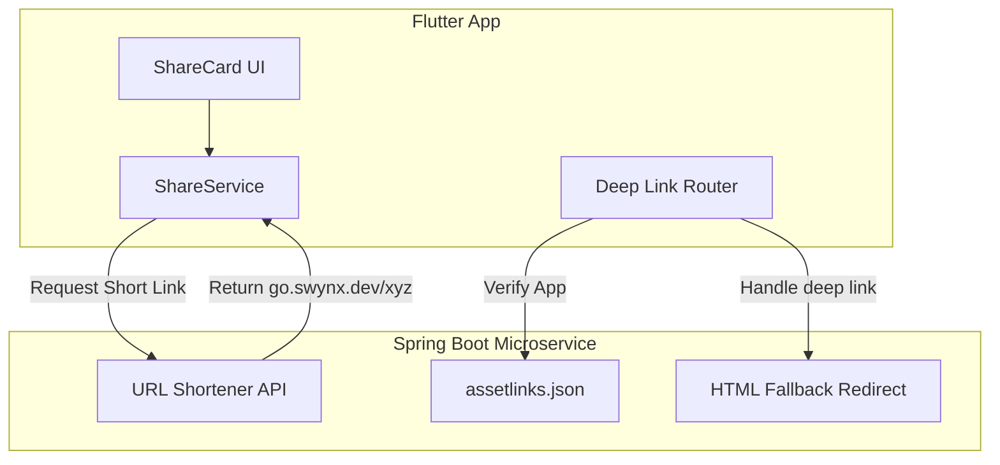
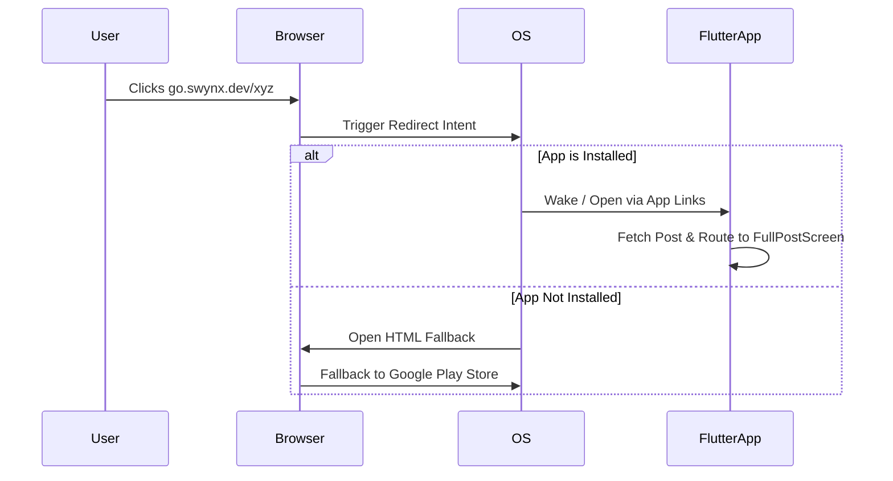

# LinkPeer Share & Deep Linking Implementation Guide

This document outlines the complete architecture and step-by-step implementation of the rich-sharing and deep-linking system built for LinkPeer.

## Overview of the Architecture

The system consists of two major components working together:

1. **Spring Boot Microservice (`go.swynx.dev`)**: Responsible for URL shortening, Android App Link verification, and aggressive intent-based redirects.
2. **Flutter App (`igit_connects`)**: Responsible for rendering visual share cards, generating images, and routing deep links directly to specific posts.

---

## 1. The Spring Boot URL Shortener

To make share links look professional and trackable, we built a custom URL shortener.

- **API Controller**: We created `LinkController.java` with a `/api/links` endpoint. The Flutter app calls this endpoint, passing the deep link (e.g., `linkpeer://post/123`). The server generates a unique 6-character slug and returns `https://go.swynx.dev/xyz`.
- **Android App Links Verification**: We hosted an `assetlinks.json` file at `https://go.swynx.dev/.well-known/assetlinks.json`. This cryptographic file proves to the Android OS that `go.swynx.dev` is owned by the LinkPeer app developers.
- **Aggressive HTML Fallback**: When a user clicks a link (e.g., from WhatsApp or Instagram), sometimes the in-app browser intercepts it. To bypass this, our redirect endpoint returns `redirect-template.html`. This HTML page uses JavaScript to fire an `intent://` URL, which forces Android to open the LinkPeer app directly. If the app isn't installed, it falls back to the Google Play Store.

## 2. Flutter: Visual Share Generation

When a user taps "Share" on a post, we don't just share text. We generate a beautiful image.

- **The ShareCard Widget**: We built `ShareCard.dart`, a visually stunning widget that mimics a Twitter/X style card. It displays the author's avatar, name, role, the post content, and a custom LinkPeer watermark logo at the bottom.
- **Screenshot & SharePlus**: In `ShareService.dart`, we use the `screenshot` package. We render the `ShareCard` entirely off-screen, capture it as a raw byte array, and save it as a temporary `.png` file.
- **Native Share Sheet**: We then use `share_plus` to invoke the native iOS/Android share sheet. We pass it the generated PNG image and the `go.swynx.dev` short URL.

## 3. Flutter: App Links & Cold Starts

We needed to ensure that clicking a link always opens the specific post, whether the app is running or completely closed.

- **AndroidManifest.xml**: We added `<intent-filter>` blocks to register both our custom scheme (`linkpeer://`) and our verified domain (`https://go.swynx.dev`).
- **The `app_links` Package**: In `main.dart`, we implemented a robust `_initDeepLinks()` method.
  - **Cold Starts**: We use `_appLinks.getInitialLink()` during `initState()`. If the user opens a link while the app is fully terminated, the app wakes up, catches the URL, fetches the post from Supabase, and immediately routes to `FullPostScreen`.
  - **Background Resumes**: We listen to `_appLinks.uriLinkStream`. If the app is minimized, clicking a link will push the `FullPostScreen` onto the active navigation stack.

## 4. The Unauthenticated User Experience

If someone shares a post with a friend who has the app but hasn't logged in, we want them to see the content without crashing.

- **Read-Only Mode**: `FullPostScreen.dart` gracefully checks `FirebaseAuth.instance.currentUser`. If the user is null, they can still read the entire post.
- **Premium Call-To-Action**: The standard action bar (Like, Comment, Save) is dynamically replaced. Unauthenticated users see a highly styled, theme-aware "Login to see more" button.
- **Seamless Login Routing**: Tapping the banner executes `Navigator.of(context).pushAndRemoveUntil(...)`, wiping the navigation stack and securely dropping the user into `LoginScreen2` to authenticate.

---

### Packages Used

- `app_links`: For handling Android/iOS deep links and cold starts.
- `share_plus`: To trigger the native OS share sheet.
- `screenshot`: To render Flutter widgets off-screen and convert them to PNG images.
- `path_provider`: To save the generated image to temporary local storage before sharing.
- `http`: To communicate with the Spring Boot short-link API.
