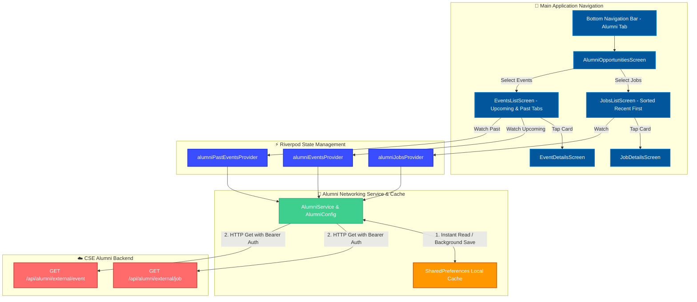

# Alumni Opportunities Hub Technical Documentation

This document describes the design, architecture, data models, networking layer, caching strategy, and UI screens for the **Alumni Opportunities** feature in `LinkPeer` (`igit_connects`).

---

## 1. Feature Overview

The **Alumni Opportunities** section serves as a native hub within the application connecting students and alumni with career prospects and department events powered by the CSE Alumni Network backend.

It is accessible directly from the bottom navigation bar and provides:
1. **Redesigned Landing Dashboard (`AlumniOpportunitiesScreen`)**:
   - **Hero Header Card**: Displays IGIT CSE Alumni Cell branding with live "Official Sync Active" status indicator.
   - **Real-Time Metrics Bar**: Dynamic counters for **Active Listings** and **Upcoming Events** computed from live state.
   - **Live Recent Spotlights**: Dynamic preview cards for the newest job position (`LATEST OPPORTUNITY`) and upcoming event (`UPCOMING EVENT HIGHLIGHT`) featuring real backend data (zero mock data).
   - **IGIT CSEA Website Card**: Interactive wrap card linking directly to `https://cse.igitalumni.in/`.
   - **Partner Collaboration Badge**: Restored **MELO × SWYNX** partner badge in the AppBar.
   - **Bottom Sticky Ad**: Embedded `BannerAdWidget` anchored right above the bottom navigation bar.
2. **Jobs & Internships (`JobsListScreen`)**:
   - Career opportunities sorted with the **most recent listings at the top**.
   - Pre-filled email application launcher matching web portal behavior.
3. **Alumni Events (`EventsListScreen`)**:
   - Segmented toggle (**Upcoming Events** & **Past Events Archive**), date badges, external registration links, and organizer contacts.

---

## 2. System Architecture



---

## 3. Cache-First (Stale-While-Revalidate) Strategy

To ensure zero-wait startup times and offline resilience, `AlumniService` implements a **Cache-First Architecture**:

1. **Instant UI Delivery (0ms Wait)**:
   - When screens request jobs or events, `AlumniService.getCachedJobs()` and `AlumniService.getCachedEvents()` read from local `SharedPreferences` keys (`cached_alumni_jobs` and `cached_alumni_events`).
   - Cached records render instantly without showing a blank screen or loading spinner.
2. **Background Network Refresh**:
   - `AlumniService.fetchJobs()` and `AlumniService.fetchEvents()` issue HTTP GET requests to the Render backend endpoints.
   - Upon receiving HTTP 200 OK, the raw JSON payload is persisted to `SharedPreferences` to refresh the local cache, and the UI updates silently.
3. **Cold-Start & Offline Resilience**:
   - If the Render backend server is cold-starting (delayed response) or the user is offline, the service falls back to local cache gracefully.

---

## 4. Directory Structure

```text
lib/features/alumni/
├── config/
// Obfuscated Base64 fallback, endpoint URLs, and secure Bearer Token resolution
│   └── alumni_config.dart
│
├── models/
// Data models with robust JSON parsing and createdAt timestamp support
│   ├── alumni_job_model.dart
│   └── alumni_event_model.dart
│
├── services/
// HTTP networking service with cache-first persistence & recent job sorting
│   └── alumni_service.dart
│
├── providers/
// Riverpod providers with auto-dispose & pull-to-refresh support
│   └── alumni_provider.dart
│
└── screens/
// Feature UI views
    ├── alumni_opportunities_screen.dart   # Redesigned landing dashboard with spotlights & banner ad
    ├── jobs_list_screen.dart             # Card list view with recent sorting & Apply launcher
    ├── job_details_screen.dart           # Job description, salary, & recruiter contact launcher
    ├── events_list_screen.dart          # Segmented control (Upcoming/Past), date badges
    └── event_details_screen.dart        # Event agenda, registration link & organizer email
```

---

## 5. API Endpoints & Security

### Secure Token & URL Configuration
The Bearer Token (`ALUMNI_BEARER_TOKEN`) and Base URL (`ALUMNI_BASE_URL`) are loaded dynamically via `flutter_dotenv` from `.env`:
```env
ALUMNI_BEARER_TOKEN=your_secure_alumni_bearer_token
ALUMNI_BASE_URL=https://your-backend-api-domain.com/api/alumni/external
```
`AlumniConfig` utilizes runtime obfuscation fallbacks, ensuring zero plain-text raw keys or live credentials exist in repository code or public documentation.

### Endpoints

| Resource | Primary Endpoint | HTTP Method | Auth Header |
| :--- | :--- | :--- | :--- |
| **Jobs & Internships** | `/api/alumni/external/job` | `GET` | `Authorization: Bearer <TOKEN>` |
| **Alumni Events** | `/api/alumni/external/event` | `GET` | `Authorization: Bearer <TOKEN>` |
| **Post Opportunity** | `/api/alumni/external/job` | `POST` | `Authorization: Bearer <TOKEN>` |

---

## 6. Data Models & Sorting Logic

### Recent Jobs Sorting (`alumni_service.dart`)
- **Recent Jobs First**: Jobs fetched from the backend are automatically sorted in descending order of creation date (`createdAt` / `_id` timestamp). Newest opportunities always appear at the top.

### AlumniJob (`alumni_job_model.dart`)
- `id`: Unique position identifier (`_id` or `id`).
- `posterName`: Shared/posted by alumni member name.
- `type`: Category badge (`Internship` or `Job`).
- `title`: Position title (e.g. "QA intern").
- `company`: Hiring organization (e.g. "MELO AI").
- `location`: Position location (e.g. "Remote").
- `description`: Detailed position description.
- `salaryRange`: Monthly stipend / annual salary (e.g. "₹15000/month").
- `contactEmail`: Recruiter / contact email for `mailto:` action.
- `createdAt`: ISO 8601 creation timestamp string.

### AlumniEvent (`alumni_event_model.dart`)
- `id`: Event identifier.
- `title`: Event name (e.g. "HELLO").
- `description`: Detailed overview of event.
- `date`: ISO date string (parsed into `16 AUG` date badge and full format `Aug 16, 2026`).
- `time`: Scheduled time (e.g. "8 PM").
- `location`: Venue details (e.g. "IGIT Campus, Sarang - Gopabandhu Auditorium").
- `priority`: Visual badge (`High`, `Medium`, `Low`).
- `registrationLink`: External registration link (`https://...`) opened via `url_launcher`.
- `agenda`: Detailed schedule / agenda items.
- `contactEmail`: Organizer contact email.
- `organizer`: Hosting body (e.g. "CSE Alumni Cell").

---

## 7. Key Features & Resilient Email Launcher

1. **Pre-filled Web-Matching Email Application Launcher**:
   - Tapping **Apply Now** launches native mail apps (`mailto:`) constructed via `mailto:<email>?subject=Application for <Job Title> via Alumni Network`.
   - Pre-fills:
     - **To**: Registered recruiter email (`contactEmail`, e.g. `contact@meloapp.ai`).
     - **Subject**: `Application for <Job Title> via Alumni Network`.
   - Automatically falls back to **Gmail Web Composer** (`https://mail.google.com/mail/?view=cm&fs=1&tf=cm&source=mailto&to=...&su=...`) matching the web portal URL structure.
2. **Android Package Visibility (`AndroidManifest.xml`)**:
   - Includes `<queries>` for `android.intent.action.SENDTO` (`mailto`) and `android.intent.action.VIEW` (`https`) ensuring Android 11+ intent resolution.
3. **Live Spotlight Cards & Web Banner**:
   - **LATEST OPPORTUNITY**: Dynamic spotlight card displaying the newest job post.
   - **UPCOMING EVENT HIGHLIGHT**: Dynamic spotlight card displaying the upcoming event date badge & location.
   - **IGIT CSEA Website Card**: Direct link card to `https://cse.igitalumni.in/`.
4. **Bottom AdMob Banner**:
   - Sticky `BannerAdWidget` anchored above the bottom navigation bar.


