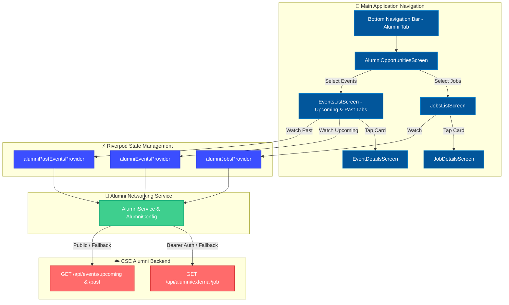

# Alumni Opportunities Hub Technical Documentation

This document describes the design, architecture, data models, networking layer, and UI screens for the **Alumni Opportunities** feature in `LinkPeer` (`igit_connects`).

---

## 1. Feature Overview

The **Alumni Opportunities** section serves as a native hub within the application connecting students and alumni with career prospects and department events powered by the CSE Alumni Network backend.

It is accessible directly from the bottom navigation bar (replacing the previous Bookmark tab) and provides entry to two dedicated modules:
1. **Jobs & Internships** (Career opportunities, stipends/salaries, recruiter contacts)
2. **Alumni Events** (Upcoming & Past events, event agendas, external registration links, contact organizers)

---

## 2. System Architecture



---

## 3. Directory Structure

```text
lib/features/alumni/
├── config/
// Configuration, endpoint URLs, and secure Bearer Token resolution
│   └── alumni_config.dart
│
├── models/
// Data models with robust JSON parsing
│   ├── alumni_job_model.dart
│   └── alumni_event_model.dart
│
├── services/
// HTTP networking service with fallback candidates & timeout handling
│   └── alumni_service.dart
│
├── providers/
// Riverpod providers with auto-dispose & pull-to-refresh support
│   └── alumni_provider.dart
│
└── screens/
// Feature UI views
    ├── alumni_opportunities_screen.dart   # Landing page with Jobs & Events option cards
    ├── jobs_list_screen.dart             # Card list view with shimmer, empty, and retry
    ├── job_details_screen.dart           # Job description, salary, & recruiter email launcher
    ├── events_list_screen.dart          # Segmented control (Upcoming/Past), date badges
    └── event_details_screen.dart        # Event agenda, registration link & organizer email
```

---

## 4. API Endpoints & Security

### Secure Token Configuration
The Bearer Token (`ALUMNI_BEARER_TOKEN`) is stored in `.env` and loaded dynamically via `flutter_dotenv`:
```env
ALUMNI_BEARER_TOKEN=milan_cse_secure_sync_key_77077
```
`AlumniConfig.bearerToken` reads the value without exposing keys in Dart source code. `.env` is ignored in `.gitignore` to prevent committing secrets to source control.

### Endpoints

| Resource | Primary Endpoint | Fallback Endpoint(s) | HTTP Method | Auth Header |
| :--- | :--- | :--- | :--- | :--- |
| **Jobs & Internships** | `/api/alumni/external/job` | `/api/jobs`, active portal listings | `GET` | `Authorization: Bearer <TOKEN>` |
| **Upcoming Events** | `/api/events/upcoming` | `/api/alumni/external/event`, `/api/events` | `GET` | `Authorization: Bearer <TOKEN>` |
| **Past Events Archive** | `/api/events/past` | `/api/alumni/external/events/past` | `GET` | `Authorization: Bearer <TOKEN>` |

---

## 5. Data Models

### AlumniJob (`alumni_job_model.dart`)
- `id`: Unique position identifier (`_id` or `id`).
- `posterName`: Shared/posted by alumni member name.
- `type`: Category badge (`Internship` or `Job`).
- `title`: Position title (e.g. "QA intern").
- `company`: Hiring organization (e.g. "MELO AI").
- `location`: Position location (e.g. "Remote").
- `description`: Detailed position description.
- `salaryRange`: Monthly stipend / annual salary (e.g. "₹15000/month").
- `contactEmail`: Recruiter / contact email for `mailto:` action.

### AlumniEvent (`alumni_event_model.dart`)
- `id`: Event identifier.
- `title`: Event name (e.g. "HELLO").
- `description`: Detailed overview of event.
- `date`: ISO date string (parsed into `16 AUG` date badge and full format `Aug 16, 2026`).
- `time`: Scheduled time (e.g. "8 PM").
- `location`: Venue details (e.g. "IGIT Campus, Sarang - Gopabandhu Auditorium").
- `priority`: Visual badge (`High`, `Medium`, `Low`).
- `registrationLink`: External registration link (`https://...`) opened via `url_launcher`.
- `agenda`: Detailed schedule / agenda items.
- `contactEmail`: Organizer contact email.
- `organizer`: Hosting body (e.g. "CSE Alumni Cell").

---

## 6. Key Features & Design System Integration

1. **Native Design Consistency**:
   - Reuses `AppColors.of(context)` across both light and dark themes.
   - Preserves typography, border radius (16px cards), card elevation, and touch feedback.
2. **Upcoming vs. Past Events Segmented Control**:
   - Modern pill toggle at top of `EventsListScreen` allowing users to switch between **Upcoming** events and **Past Events Archive**.
3. **External Launchers (`url_launcher`)**:
   - `mailto:` email actions for contacting job recruiters and event organizers directly from the native app.
   - `LaunchMode.externalApplication` browser launching for registration links.
4. **Resilient UX**:
   - **Shimmer Loading**: Smooth shimmer placeholders matching app theme while data loads.
   - **Pull-to-Refresh**: Native `RefreshIndicator` triggering Riverpod refresh (`ref.refresh(...)`).
   - **Error & Retry**: Useful error messages handling timeout, offline, or Render server sleep cold starts with **Retry** buttons.
