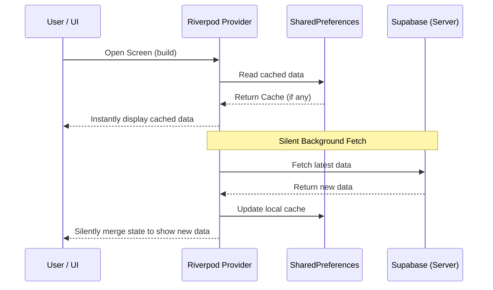

# Cache-First Background Fetch Strategy

## Overview

The "Cache-First Background Fetch" is an architecture pattern implemented in this application to ensure an ultra-fast, responsive user experience while minimizing redundant network calls. It is heavily utilized across the Home, Profile, Notifications, and Broadcast screens.

## How It Works

1. **Instant Loading**: When a user opens a screen, the state management provider (Riverpod) instantly reads from local `SharedPreferences` (or another local cache).
2. **Immediate Display**: The UI receives the cached data immediately. Users see the content they expect without any loading spinners.
3. **Silent Background Update**: While the user is interacting with the cached data, the provider dispatches an asynchronous network request to fetch the latest data from the server (Supabase/Firebase).
4. **Seamless Merge**: Once the background request completes, it updates the local cache and the Riverpod state simultaneously. The UI updates silently to show new posts or notifications without jarring layouts or spinner interruptions.

## Key Benefits

- **Zero-Wait User Experience**: Eliminates "loading screen fatigue." Users can immediately start consuming content.
- **Offline Support**: If the user is offline or has a poor connection, they can still view the previously cached content seamlessly.
- **Reduced Stuttering**: By pairing this strategy with `CachedNetworkImage`, scrolling up and down a feed doesn't drop frames or blank out images since the content is already fetched and physically cached on disk.
- **Efficient Network Usage**: The background fetch only pulls the latest required data, preventing duplicate API calls when navigating between tabs.

## Implementation Rules

- **Avoid Global Invalidations**: Instead of using `ref.invalidate(provider)` when a user likes or saves a post, update the specific item locally in the provider's state list. This avoids throwing away the entire cached list and refetching.
- **Pull-to-Refresh**: `RefreshIndicator` should call a dedicated `forceRefresh()` or `fetchFromNetwork()` method on the provider to deliberately skip the initial cache step and update the cache with fresh data.

## Applied Screens

- **Home Screen (Posts)**: Loads last known feed immediately. Local state updates handle likes and bookmarks.
- **Profile Screen**: Instantly shows user details before syncing with the backend.
- **Notifications Screen**: Caches unread/read states locally, fetching new ones in the background.
