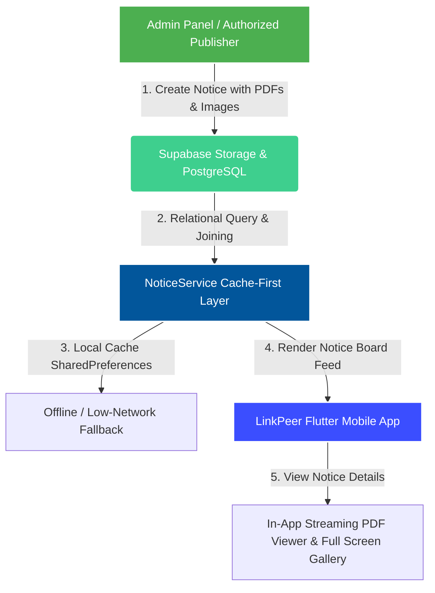

# Official Campus Notice Board System

This document outlines the architecture, database schema, caching strategy, and user permission framework for the **Official Campus Notice Board System** in LinkPeer.

---

## 1. Overview & Key Capabilities

The **Campus Notice Board System** provides an official, verified channel for institutional announcements across IGIT Sarang. 

### Key Features:
- **Verified Publisher Authorization:** Only users with `Admin` role or explicit entries in the `notice_publishers` table can create, edit, or publish notices.
- **Categorized Feed & Filtering:** Real-time filtering by category (*Examination*, *Academics*, *Placement*, *Events*, *Administrative*, *General*) and full-text keyword search.
- **Interactive Links & Hashtags (`HashtagText` Integration):** Notice content automatically detects, highlights, and renders web URLs (`https://...`, `http://...`, `www....`) as interactive blue links. Tapping any link launches the external system browser directly. Hashtags (`#hashtag`) are automatically styled and highlighted.
- **Urgent / Important Announcements:** Priority pinning with prominent alert badges for time-sensitive notices.
- **Attachment Support:** Multi-image galleries (dynamic layouts for single vs multiple images) and attached PDF documents.
- **In-App PDF Reader:** Streaming PDF viewer with Google Docs Viewer in-app fallback and external viewer support.
- **Publisher Metadata:** Displays full sender details including **Name**, **Designation**, **Department/Branch**, and **User Type** (*FACULTY*, *ADMIN*).

---

## 2. Database Schema (PostgreSQL / Supabase)

### `notices` Table
| Column | Type | Constraints | Description |
| :--- | :--- | :--- | :--- |
| `id` | `UUID` | PRIMARY KEY | Unique notice identifier |
| `title` | `TEXT` | NOT NULL | Notice title |
| `content` | `TEXT` | NOT NULL | Body content / details |
| `category` | `VARCHAR(50)` | NOT NULL | Notice category (*Examination*, *Academics*, etc.) |
| `publisher_id` | `UUID` | REFERENCES `users(id)` | Author/publisher user ID |
| `is_important` | `BOOLEAN` | DEFAULT `false` | Urgent alert status |
| `external_url` | `TEXT` | OPTIONAL | External reference web link |
| `created_at` | `TIMESTAMPTZ` | DEFAULT `now()` | Publication timestamp |
| `updated_at` | `TIMESTAMPTZ` | DEFAULT `now()` | Last edit timestamp |

### `notice_attachments` Table
| Column | Type | Constraints | Description |
| :--- | :--- | :--- | :--- |
| `id` | `UUID` | PRIMARY KEY | Attachment ID |
| `notice_id` | `UUID` | REFERENCES `notices(id)` | Parent notice ID |
| `file_path` | `TEXT` | NOT NULL | Storage bucket file path |
| `file_name` | `TEXT` | NOT NULL | Original filename |
| `file_type` | `VARCHAR(20)` | NOT NULL | Attachment type (`pdf` or `image`) |
| `file_size` | `BIGINT` | DEFAULT 0 | File size in bytes |
| `created_at` | `TIMESTAMPTZ` | DEFAULT `now()` | Upload timestamp |

### `notice_publishers` Table
| Column | Type | Constraints | Description |
| :--- | :--- | :--- | :--- |
| `id` | `UUID` | PRIMARY KEY | Permission record ID |
| `user_id` | `UUID` | REFERENCES `users(id)` UNIQUE | Authorized publisher user ID |
| `created_by` | `UUID` | REFERENCES `users(id)` | Admin user who granted access |
| `is_active` | `BOOLEAN` | DEFAULT `true` | Active status flag |
| `created_at` | `TIMESTAMPTZ` | DEFAULT `now()` | Permission grant timestamp |

---

## 3. Caching & Performance Strategy

The `NoticeService` implements a **Cache-First Architecture**:
1. On initial feed launch, `NoticeService` immediately loads locally cached notices from `SharedPreferences` (`cached_notices_$catKey`).
2. Asynchronously fetches the latest notice list from Supabase PostgreSQL (`publisher:users!notices_publisher_id_fkey`).
3. Updates the UI seamlessly and writes the fresh payload back to disk cache for zero-wait offline viewing.

---

## 4. Administration & Publisher Management

- **Granting Permission:** Admins can search users by email/name and grant notice publishing permissions via `AdminNoticePublishersScreen` or `LinkPeer-Admin-Panel`.
- **Revoking Permission:** Revoking permission immediately removes the record from `notice_publishers`, stripping publication rights and updating publisher listings across the system instantly.

