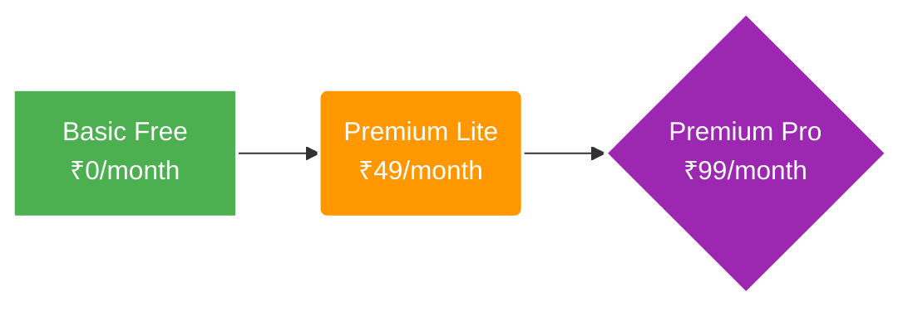

# LinkPeer Subscription Tiers

This document outlines the features and exact limits for all LinkPeer user tiers, directly reflecting the internal application logic.

## 1. Basic Free

The default tier for all users.

- **Profile Visibility:** Standard
- **Daily Posts Limit:** Up to 3 posts per day
- **Image Posts Limit:** Up to 5 image posts per month
- **Images Per Post:** Up to 2 images per post
- **Support:** Community support
- **Price:** ₹0/month

## 2. Premium Lite

Essential tools for active users and students.

- **Profile Visibility:** Boosted
- **Verification:** Verified badge on profile
- **Daily Posts Limit:** Up to 10 posts per day
- **Image Posts Limit:** Up to 15 image posts per month
- **Images Per Post:** Up to 4 images per post
- **Price:** ₹49/month

## 3. Premium Pro

Maximum visibility and unlimited freedom.

- **Profile Visibility:** Maximum directory visibility
- **Verification:** Verified badge on profile
- **Daily Posts Limit:** Unlimited
- **Image Posts Limit:** Unlimited
- **Images Per Post:** Unlimited
- **Support:** Priority 24/7 support
- **Price:** ₹99/month
