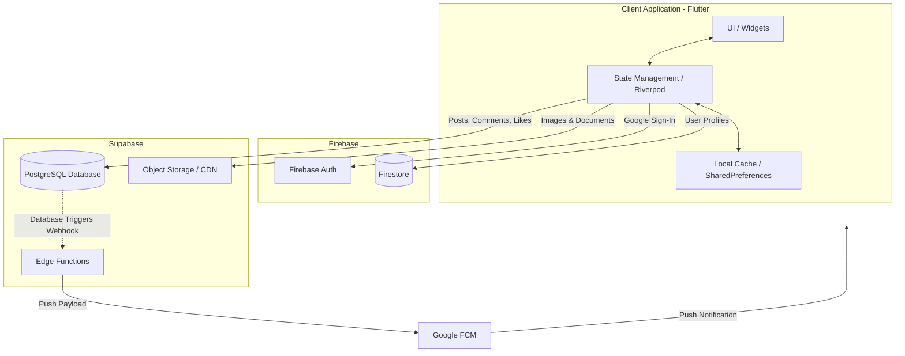
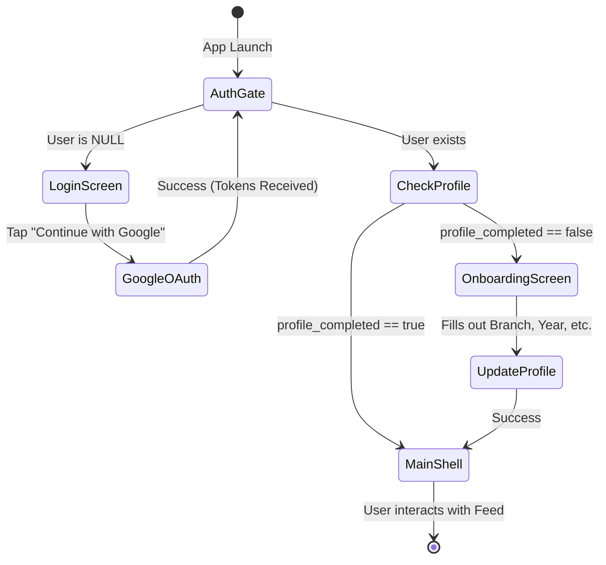
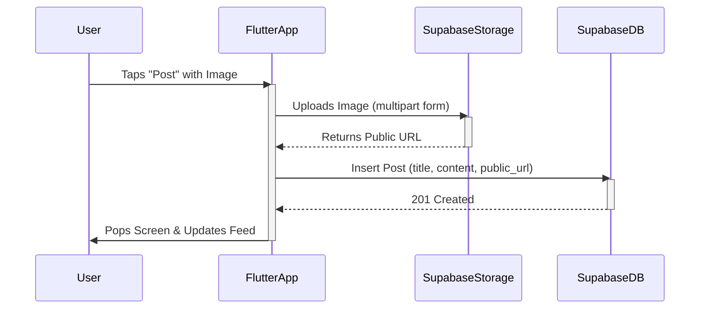
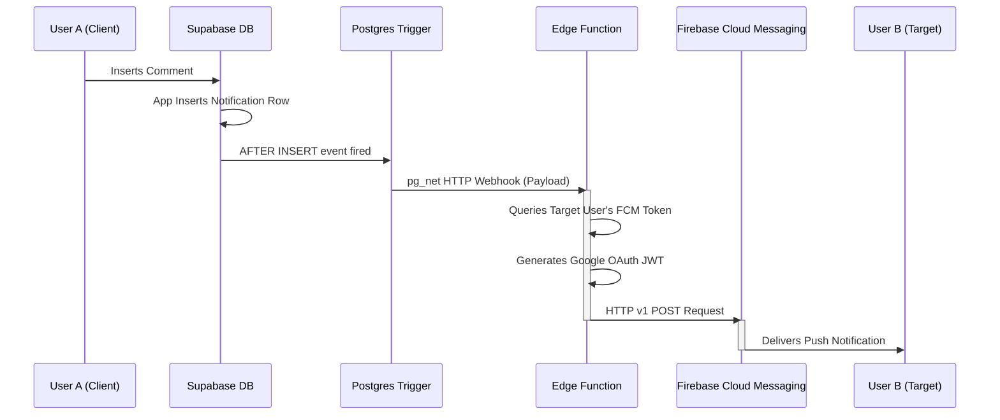

# LinkPeer: System Design & App Flow

This document outlines the complete system architecture, data flow, and user journey for **LinkPeer**. The application uses a hybrid backend approach (Firebase + Supabase) to leverage the best of both platforms: Firebase for seamless Google Authentication, and Supabase for robust relational data and serverless Edge Functions.

---

## 1. High-Level System Architecture

The overarching architecture is event-driven and heavily relies on Riverpod for state management on the client-side.

---

## 2. Authentication & Onboarding Flow

Authentication dictates what screens the user has access to. The app uses `AuthGate` as the central traffic controller to route users based on their Firebase Auth status and profile completion state.

---

## 3. Data Flow: Creating a Post with an Image

When a user creates a new post with a file/image attachment, the client coordinates between Supabase Storage and the PostgreSQL database.

---

## 4. Notification Flow (Serverless Event-Driven)

This flow ensures that API keys remain secure and that notifications are handled independently of the client application logic.

---

## 5. Directory Mapping to Architecture

- **`lib/main.dart`**: Entry point; initializes Firebase, Supabase, Theme, and Notification Services.
- **`lib/core/auth_gate.dart`**: Implements the Authentication & Onboarding state machine.
- **`lib/core/google_auth_controller.dart`**: Bridges the gap between the Google SDK and Firebase Auth.
- **`lib/core/providers/`**: Holds Riverpod logic that caches data from Firestore (users) and Supabase (posts) locally.
- **`supabase/functions/`**: Holds the server-side TypeScript code for the event-driven notification flow.
